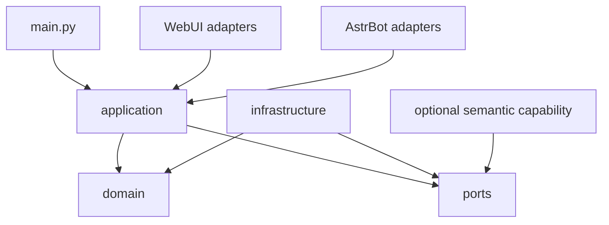

# Architecture Boundaries

The plugin is being migrated incrementally toward a dependency direction where
entry points and adapters call application services, application services depend
on stable domain/port contracts, and infrastructure implements those ports.

## Stable contracts

- `PackResolver.resolve(pack_id) -> PackContext`
- `ImageRepository.save(content, tags) -> SaveResult`
- `CatalogRepository.reconcile(pack) -> ReconcileReport`
- `SelectionService.choose(request) -> SelectionResult`
- `SemanticCapability.status/query` for optional semantic behavior

`PackId`, `Category`, `MemeId`, `PackContext`, `SelectionResult`, and
`OperationError` are immutable boundary values. User-provided paths are resolved
through `PackContext` or `PathBoundary` and must remain inside the selected pack.

## Compatibility rules

Existing WebUI routes, configuration keys, pack formats, and mixin entry points
remain stable while the implementation moves behind the new contracts. Legacy
semantic metadata is handled by a narrow cleanup adapter; semantic runtime
modules are loaded lazily and are never required for core startup.

Storage migration boundaries are exposed through `CatalogRepository`,
`ImageRepository`, `SelectionState`, `PackPaths`, `PackRuntime`, `PackTransfer`,
`PackBackup`, and `CommunityPackSource`. `MemeStore` and `pack_storage.py`
remain compatibility facades until their callers have migrated.

Run `python scripts/check_architecture.py` and
`python scripts/architecture_metrics.py` before merging structural changes.
